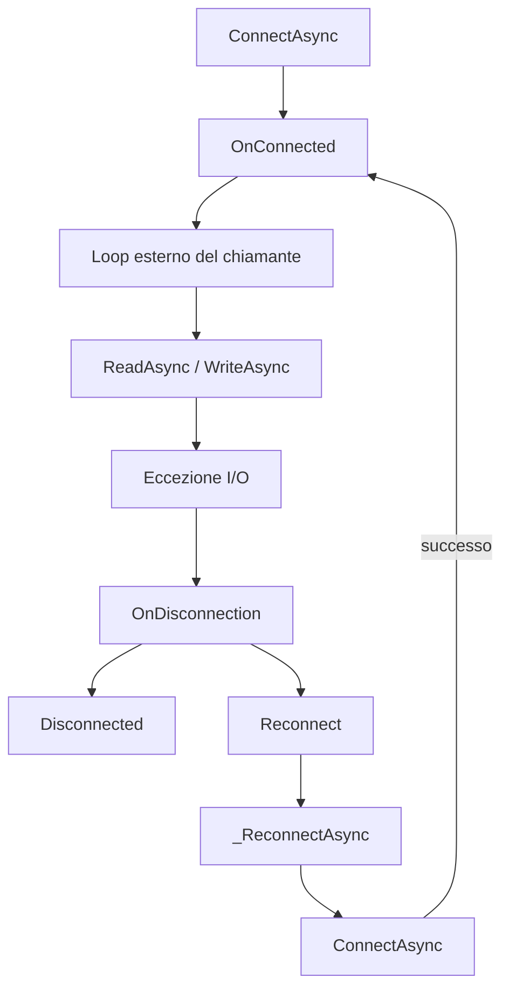

# Confronto delle 3 implementazioni di TcpClient

## Panoramica

| Caratteristica | _Fael.cs | _SiDel.cs | _Mb.cs |
| --- | --- | --- | --- |
| **Namespace** | `Sistec.Core.Devices` | `Sistec.Core.Devices` | `Sistec.Core` |
| **Using extra** | - | - | `Sistec.Asyril.Utils` |
| **Nullable** | Si (C# moderno, `?`) | No (stile pre-nullable) | Si (C# moderno, `?`) |
| **Logger** | `Utilities.Logger` (statico) | `ILogger _logger` (istanza) | `ILogger _logger` (istanza) |
| **Nome istanza** | Nessuno | `Name` (con contatore `i++`) | `Name` (con `_instanceCounter` thread-safe) |
| **Evento Error** | No | Si | Si |
| **MonitorErrors** | No | Si | Si |
| **Pending Read** | No | No | Si |

---

## 1. Namespace e dipendenze

- **_Fael** e **_SiDel**: usano `Sistec.Core.Devices`
- **_Mb**: usa `Sistec.Core` e aggiunge il riferimento a `Sistec.Asyril.Utils`

## 2. Naming e identificazione istanze

| | _Fael | _SiDel | _Mb |
| --- | --- | --- | --- |
| Proprietà `Name` | Assente | Presente | Presente |
| Contatore istanze | Nessuno | `static int i = 0` (non thread-safe, `i++`) | `static int _instanceCounter` (thread-safe, `Interlocked.Increment`) |
| Costruttore con nome | Assente | Presente ma **il parametro `name` viene ignorato** (commentato) | Presente e **funzionante** (`Name = name`) |

**Nota importante**: in `_SiDel.cs` il costruttore `TcpClient(string name)` ha il corpo commentato (`// => Name = name;`), quindi il nome passato viene scartato.

## 3. Sistema di logging

- **_Fael**: usa il logger statico globale `Utilities.Logger` con string interpolation diretta (`$"..."`)
- **_SiDel**: usa un `ILogger _logger` di istanza iniettato via `Use(ILogger)`, ma con **string interpolation** (`$"..."`) — non sfrutta i template strutturati di Serilog
- **_Mb**: usa un `ILogger _logger` di istanza iniettato via `Use(ILogger)`, con **template strutturati di Serilog** (`"{Name} Trying to connect to {IpAddress}:{Port}"`) — approccio corretto per logging semantico

## 4. Gestione errori e monitoraggio

### Evento `Error` e `MonitorErrors`

- **_Fael**: non ha ne l'evento `Error` ne il monitoraggio errori
- **_SiDel** e **_Mb**: entrambi hanno `ErrorsPerSecond`, `MaxErrorsPerSecond`, evento `Error` e metodo `MonitorErrors()`

### Differenza nel ciclo di MonitorErrors

- **_SiDel**: il loop controlla `while (Connected)` — usa solo il flag booleano
- **_Mb**: il loop controlla `while (IsConnected())` — usa il metodo thread-safe con lock

### Gestione eccezioni in ReadAsync

| Eccezione | _Fael | _SiDel | _Mb |
| --- | --- | --- | --- |
| `IOException` | Chiama `Disconnect()` + `OnDisconnection()` | Solo `OnDisconnection()` | Solo `OnDisconnection()` |
| `InvalidOperationException` | Chiama `Disconnect()` + `OnDisconnection()`, ritorna `NotConnected` | Incrementa `ErrorsPerSecond`, ritorna `Fail` | Incrementa `ErrorsPerSecond`, ritorna `Fail` |
| `ObjectDisposedException` | Non gestita separatamente | Gestita con `when (!Connected)` | Gestita con `when (!Connected)` |

**Differenza critica**: in `_Fael`, una `InvalidOperationException` durante la lettura causa disconnessione e riconnessione. In `_SiDel`/`_Mb` viene trattata come errore soft (contatore errori) senza disconnessione, a meno che non superi `MaxErrorsPerSecond`.

### Gestione eccezioni in WriteAsync

- **_Fael**: cattura separatamente `InvalidOperationException` (con `OnDisconnection`) e `IOException`
- **_SiDel** e **_Mb**: catturano solo `IOException` + un generico `Exception`, con logging dettagliato (messaggio + stack trace + inner exception)

## 5. Pending Read (solo _Mb)

`_Mb.cs` introduce un meccanismo di **pending read** assente nelle altre due versioni:

```csharp
private Task<int>? _pendingReadTask;
private char[]?    _pendingBuffer;
```

Se una `ReadAsync` va in timeout, il task di lettura non viene abbandonato. Alla chiamata successiva viene **riutilizzato** lo stesso task. Questo risolve il problema per cui `StreamReader` non supporta letture concorrenti: senza questo meccanismo, un timeout lascia un read "orfano" e la successiva `ReadAsync` lancia una `InvalidOperationException`.

## 6. Connessione e evento OnConnected

| | _Fael | _SiDel | _Mb |
| --- | --- | --- | --- |
| `OnConnected` invocato in | `ConnectAsync(IPAddress)` (alla fine) | `ConnectAsync(string)` (dopo il risultato) | `ConnectAsync(string)` (dopo il risultato) |
| `MonitorErrors` avviato in | Mai | `ConnectAsync(string)` | `ConnectAsync(string)` |
| Dopo riconnessione | `OnConnected` invocato (perché `_ReconnectAsync` chiama `ConnectAsync(IPAddress)` che lo contiene) | `OnConnected` invocato nel `Reconnect` | `OnConnected` invocato nel `Reconnect` |

**Differenza critica**: in `_Fael`, `OnConnected` viene invocato dentro `ConnectAsync(IPAddress)`, il che significa che viene chiamato anche durante la riconnessione (perche `_ReconnectAsync` chiama `ConnectAsync`). In `_SiDel`/`_Mb`, `OnConnected` e invocato in `ConnectAsync(string)` per la prima connessione e in `Reconnect()` per le successive — ma `ConnectAsync(IPAddress)` non lo invoca.

## 7. Disconnect — gestione dispose sicura

- **_Fael** e **_SiDel**: chiamano `_reader?.Dispose()` e `_writer?.Dispose()` direttamente. Se c'e un'operazione asincrona in corso, puo lanciare `InvalidOperationException` non gestita
- **_Mb**: wrappa le dispose in `try/catch(InvalidOperationException)` con logging, evitando crash durante dispose concorrenti

## 8. Nullabilita e stile del codice

- **_Fael**: usa la sintassi C# moderna con nullable reference types (`?` su eventi e campi), `new()` senza tipo, `await using`
- **_SiDel**: stile pre-nullable, nessun `?` sugli eventi, usa `using` classico (non `await using`)
- **_Mb**: usa nullable reference types, `null!` per i campi non-nullable inizializzati dopo la costruzione, `using` classico

## 9. Reconnection Policy

- **_Fael**: usa `Sistec.Core.Utils.ReconnectionPolicy.Default`
- **_SiDel** e **_Mb**: usano `ExponentialBackoffReconnectionPolicy.Default`

## 10. Campo TcpClient interno

- **_Fael**: `_tcpClient` (nome completo)
- **_SiDel** e **_Mb**: `_tcpc` (abbreviato)

---

## 11. Flusso degli eventi: OnConnected, Disconnected e messaggi

### OnConnected

| | _Fael | _SiDel | _Mb |
| --- | --- | --- | --- |
| **Prima connessione** | Invocato in `ConnectAsync(IPAddress)` alla fine del metodo | Invocato in `ConnectAsync(string)` dopo il risultato | Invocato in `ConnectAsync(string)` dopo il risultato |
| **Riconnessione** | Invocato di nuovo perche `_ReconnectAsync` chiama `ConnectAsync(IPAddress)` che lo contiene | Invocato esplicitamente in `Reconnect()` dopo verifica `IsConnected()` | Invocato esplicitamente in `Reconnect()` dopo verifica `IsConnected()` |

**Differenza chiave**:

- **_Fael**: `OnConnected` sta dentro `ConnectAsync(IPAddress)` — viene sempre invocato, sia alla prima connessione che durante la riconnessione. Non c'e distinzione tra i due scenari.
- **_SiDel** e **_Mb**: `OnConnected` e separato in due punti distinti:
  - `ConnectAsync(string)` per la prima connessione (il metodo con `string` chiama quello con `IPAddress`, poi invoca `OnConnected` solo se ha avuto successo)
  - `Reconnect()` dopo che `reconnectAgent` ha completato con successo e `IsConnected()` e `true`

  Questo significa che `ConnectAsync(IPAddress)` — usato internamente da `_ReconnectAsync` — **non** invoca `OnConnected`. L'evento viene gestito dal chiamante.

### Disconnected

Il flusso e identico in tutte e 3 le versioni:

```text
errore I/O o eccezione → OnDisconnection() → Disconnected?.Invoke(this) → Reconnect()
```

La differenza sta in **quali eccezioni** scatenano la disconnessione:

| Eccezione | _Fael | _SiDel /_Mb |
| --- | --- | --- |
| `IOException` (Read/Write) | `OnDisconnection()` | `OnDisconnection()` |
| `InvalidOperationException` (Read) | `Disconnect()` + `OnDisconnection()`, ritorna `NotConnected` | **No disconnessione** — solo `ErrorsPerSecond++`, ritorna `Fail` |
| `InvalidOperationException` (Write) | `OnDisconnection()` | **No disconnessione** — ritorna `WriteResult.Fail(e)` |

**_Fael** e la piu aggressiva: qualsiasi `InvalidOperationException` causa disconnessione e riconnessione. **_SiDel** e **_Mb** la trattano come errore soft (contatore errori), con l'evento `Error` invocato solo se `ErrorsPerSecond > MaxErrorsPerSecond`.

### Messaggi (Read/Write) — nessun evento dedicato

Nessuna delle 3 versioni ha un **evento OnMessage**. La lettura e pull-based: il chiamante deve fare polling manualmente con un loop esterno:

```csharp
while (tcpClient.IsConnected())
{
    var result = await tcpClient.ReadAsync();
    if (result.IsSuccess) { /* gestisci il messaggio */ }
}
```

### Schema riassuntivo del flusso



---

## Riepilogo: evoluzione del codice

```text
_Fael (base) → _SiDel (aggiunge naming, error monitoring, logger di istanza)
                   → _Mb (aggiunge pending read, logging strutturato, dispose sicuro, thread safety)
```

| Miglioria | _Fael | _SiDel | _Mb |
| --- | :---: | :---: | :---: |
| Logger di istanza iniettabile | - | X | X |
| Nome istanza | - | X | X |
| Contatore thread-safe | - | - | X |
| Costruttore con nome funzionante | - | - | X |
| Monitoraggio errori/secondo | - | X | X |
| Pending read (no read concorrenti) | - | - | X |
| Logging strutturato Serilog | - | - | X |
| Dispose sicuro nel Disconnect | - | - | X |
| MonitorErrors thread-safe | - | - | X |
| Backoff esponenziale riconnessione | - | X | X |

**`_Mb.cs` rappresenta la versione piu matura e robusta**, con le migliori pratiche di thread safety, gestione degli stream asincroni e logging strutturato.
